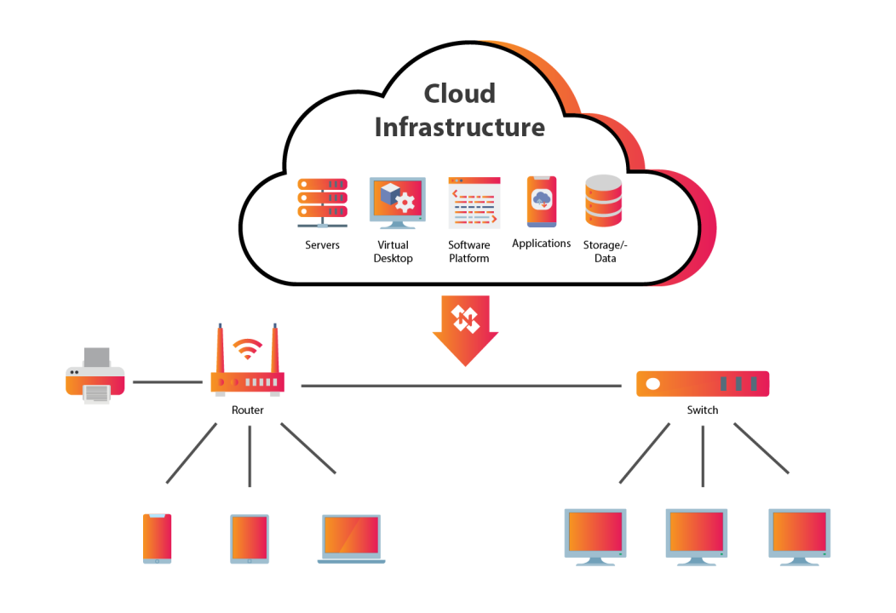

# AWS Research Questions

### 1) What is Cloud Computing? - Define cloud computing in your own words and describe its basic characteristics (on-demand access, scalability, etc.). How does cloud computing differ from traditional on-premise infrastructure?

**Answer:**

Cloud computing is the delivery of computing services—including servers, storage, databases, networking, software, and analytics—over the internet. Instead of owning and maintaining physical infrastructure, organizations can access these resources on-demand from a cloud provider.

**Key characteristics of cloud computing:**

* On-Demand Access – Resources are provisioned as needed, eliminating the need for upfront investments.

* Scalability – Resources can be scaled up or down dynamically based on demand.
* Pay-as-You-Go – Users only pay for what they use, reducing operational costs.
* Global Availability – Cloud services can be accessed from anywhere via the internet.
* Managed Services – Providers handle maintenance, security, and updates.

**Difference from On-Premise Infrastructure:**

* Traditional on-premise infrastructure requires purchasing and maintaining hardware, whereas cloud computing offers virtualized resources without upfront costs.

* Cloud environments offer faster deployment and global reach, unlike on-prem solutions, which take time to scale and are location-dependent.

### 2) Types of Cloud Computing Services: - Explain the differences between Infrastructure as a Service (IaaS), Platform as a Service (PaaS), and Software as a Service (SaaS). Provide examples of each and their use cases in the cloud.
**Answer:**

1. **Infrastructure as a Service (IaaS):** 
Provides fundamental computing resources such as virtual machines, storage, and networking.
Example: AWS EC2, Microsoft Azure Virtual Machines, Google Compute Engine.
Use Case: Companies needing flexible and scalable infrastructure without managing physical servers.

2. **Platform as a Service (PaaS):** Provides a development environment with tools and services for application development.
Example: AWS Elastic Beanstalk, Google App Engine, Microsoft Azure App Services.
Use Case: Developers building applications without worrying about underlying infrastructure.

3. **Software as a Service (SaaS):**
Delivers software applications over the internet, eliminating the need for local installation.
Example: Google Workspace (Gmail, Docs), Microsoft Office 365, Salesforce.
Use Case: Businesses using ready-made applications without managing software maintenance.

### 3) Cloud Deployment Models: - Describe the different cloud deployment models: Public Cloud, Private Cloud, and Hybrid Cloud. In which scenarios would each be used?

**Answer:**
1. **Public Cloud:** Cloud resources are owned and operated by third-party providers and shared among multiple customers.
Example: AWS, Azure, Google Cloud.
Use Case: Startups and businesses looking for cost-effective and scalable resources.

2. **Private Cloud:** Cloud infrastructure is used exclusively by one organization, either hosted on-premise or by a provider.
Example: VMware Private Cloud, OpenStack.
Use Case: Industries with strict security and compliance requirements (e.g., banking, healthcare).

3. **Hybrid Cloud:** 
A combination of public and private clouds, allowing data and applications to move between them.
Example: A company using a private cloud for sensitive workloads and a public cloud for scalability.
Use Case: Enterprises needing both security and flexibility, such as retail businesses handling customer data.

### 4)  Benefits of Cloud Computing: - What are the key benefits of cloud computing compared to traditional data centers? Focus on aspects such as cost, scalability, reliability, and speed of deployment.

**Answer:**

* Cost Efficiency: Reduces capital expenditures by shifting to a pay-as-you-go model.

* Scalability: Easily scales resources up or down based on demand.
* Reliability: Cloud providers offer redundancy and high availability (e.g., multi-region deployments).
* Speed of Deployment: New resources and applications can be launched in minutes.
* Security & Compliance: Leading cloud providers offer built-in security controls and compliance certifications.

### 5) Concerns around Cloud Computing: - Discuss the potential challenges and risks associated with cloud computing, including data security, compliance issues, vendor lock-in, and downtime concerns.

**Answer:**

* Data Security: Storing sensitive data in the cloud raises concerns about unauthorized access and breaches.

* Compliance Issues: Industries like healthcare and finance must comply with regulations like GDPR and HIPAA.
* Vendor Lock-in: Dependency on a single provider can make migration difficult and costly.
* Downtime & Reliability: Cloud services may experience outages, impacting business operations.

### 6) Basic Cloud Architecture: - Create a simple diagram of a basic cloud architecture using services like compute (EC2), storage (S3), and networking (VPC). Describe how each service interacts.

### 7) Explanation of Terms: - Define and provide examples for terms such as fault tolerance, high availability, scalability, cost optimization, and serverless computing, illustrating their significance in the context of IT infrastructure and cloud services.

**Answer:**
1. Fault Tolerance:T he ability of a system to continue operating despite failures in some components. 

    Example: Deploying applications across multiple Availability Zones (AZs) in AWS ensures redundancy.
2. High Availability: Ensuring minimal downtime by deploying resources in a way that provides continuous operation.

    Example: A web application using an Auto Scaling group with multiple EC2 instances in different AZs.

3. Scalability:The ability to handle increased workloads by adding more resources.

    Example: AWS Auto Scaling automatically increasing the number of EC2 instances based on traffic.
4. Cost Optimization: Reducing cloud expenses by selecting the right resources and pricing models.

    Example: Using AWS Reserved Instances for predictable workloads to save costs.
5. Serverless Computing: Running applications without managing servers, where cloud providers handle infrastructure management.

    Example: AWS Lambda executing functions on demand, only charging for execution time.

### 8) Compliance Considerations in Cloud Computing: - Discuss the importance of compliance with industry regulations and data protection laws in cloud computing environments. Outline key compliance requirements and measures to ensure regulatory adherence, including data encryption, access controls, audit trails, and compliance monitoring.

**Answer:**

Compliance ensures that cloud operations adhere to legal, regulatory, and security standards, reducing risks and improving trust.

Key Compliance Requirements & Measures:

* Data Encryption: Encrypt data at rest (S3, RDS) and in transit (TLS, HTTPS).

* Access Controls: Implement IAM roles and policies to restrict access.
* Audit Trails: Use AWS CloudTrail or Azure Monitor to track user activity.
* Compliance Monitoring: Continuously assess security using tools like AWS Config and Security Hub.

Common frameworks:
* GDPR (General Data Protection Regulation) for data privacy.
* HIPAA (Health Insurance Portability and Accountability Act) for healthcare data.
* ISO 27001 for information security management.

### 9) Choosing between Cloud and On-Premise Computing for Hosting a Java Containerized Application: - As an engineer tasked with choosing between cloud and on-premise computing for hosting a Java containerized application, explain your decision-making process and justify your choice based on factors such as scalability, cost, flexibility, and reliability. Additionally, outline an architectural diagram for hosting the application to serve 500 users at peak period 

#### **Decision-Making Factors:**  
| **Factor**        | **Cloud (AWS, Azure, GCP)** | **On-Premise** |
|------------------|--------------------------|--------------|
| **Scalability**  | Easily scalable via Kubernetes (EKS, AKS, GKE) | Requires additional hardware |
| **Cost**        | Pay-as-you-go, no upfront hardware cost | High upfront investment |
| **Flexibility** | Deploy in different regions, integrate with cloud-native services | Limited to available infrastructure |
| **Reliability** | High uptime with managed services | Risk of hardware failures |
| **Security**    | Cloud providers offer robust security, but data is stored externally | Full control over security, but higher responsibility |
